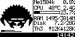

# OLED Desktop Pet

Raspberry Pi CM5 的 128×64 单色 OLED（SSD1309）系统监控桌面宠物，通过 I2C 驱动。

显示 Ferris 螃蟹精灵（带眨眼动画）+ 实时系统指标 + 事件通知。

<p align="center">
  
</p>

## 功能

- **系统监控**：CPU 温度/频率（趋势箭头+降频警告）、CPU 利用率+每核微型条、内存、网络 ↑↓ 速率、磁盘 已用/总量、自身进程 RSS/CPU%
- **通知系统**：SSH 登录、USB 插拔、网口 up/down、Type-C、IP 地址、CPU/内存/磁盘告警
- **动画**：4 Hz 渲染，ferris 眨眼，RGBA 眼球自动检测
- **夜间模式**：可配置时段自动降低 OLED 对比度
- **配置热加载**：告警阈值等参数修改后自动生效，无需重启
- **安全**：systemd 沙箱、self-pipe 信号处理、全 unsafe 审计

## 硬件

- SSD1309 128×64 OLED，I2C 地址 `0x3C`，总线 I2C-1
- GPIO10 (SDA) / GPIO11 (SCL)
- `/boot/firmware/config.txt` 需启用 I2C

## 快速开始

```bash
cd Oled_Desktop_Pet
cargo build --release
cargo run
```

安装为 systemd 服务（开机自启）：

```bash
./scripts/install-service.sh
```

## 配置

编辑 `configs/settings.toml`（25 个参数，带注释）。标注 `[热加载]` 的项修改后自动生效，其余需重启。

## 命令

```bash
cargo build              # 开发构建
cargo build --release    # 发布构建（~1.1 MB 二进制）
cargo run                # 运行
cargo test               # 46 个测试
cargo test <name>        # 单个测试
cargo clippy             # 静态检查
sudo i2cdetect -y 1      # 扫描 I2C 总线
```

## 架构

```
lib.rs (11 行) ── 模块声明
main.rs (165 行) ── 装配层（初始化→开机动画→主循环→关机动画）
├── app/          boot / config / config_reload / render / shutdown / signal
├── monitor/      cpu / cpufreq / memory / network / percore / process / thermal
├── notify/       iface / ip / ssh / system / typec / usb
├── renderer/     canvas / font / text
├── display/      framebuffer / i2c_bus / ssd1309
├── ui/           fmt / layout / widget
├── model/        SystemInfo
├── config/       TOML 设置
├── resource/     字体加载
└── utils/        错误类型 + 工具函数
```

## 部署

```bash
./scripts/install-service.sh     # 编译+安装 systemd 服务
sudo ./scripts/uninstall-service.sh  # 停止+移除
```

systemd 服务配置：`ProtectSystem=strict`，`NoNewPrivileges=yes`，自动探测 I2C 总线。

## 依赖

仅三个外部 crate：`libc`、`embedded-graphics`、`toml`。构建时依赖 `image`（PNG 解码）。

## 平台

aarch64, Debian 12 Bookworm, Linux 6.12, Rust 1.96+
